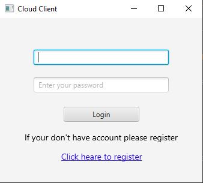
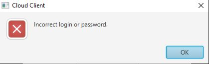
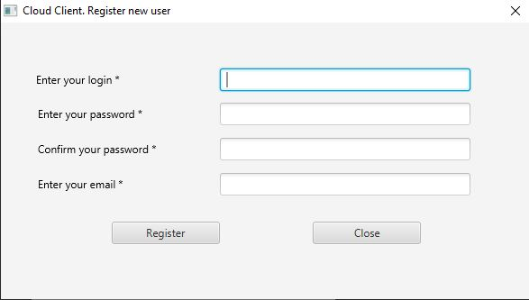
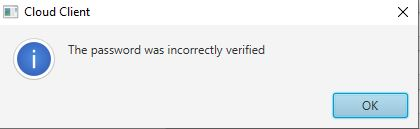
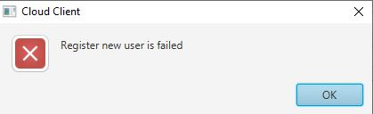
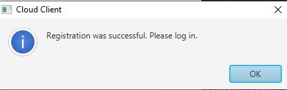
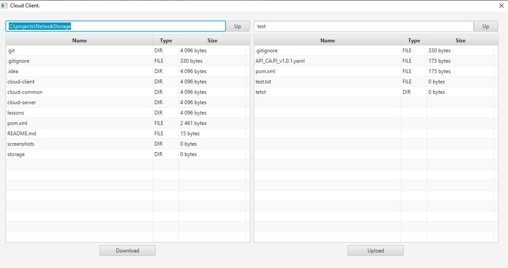

# NetwokStorage
### Учебный проект: Облачное хранилище

### Функционал приложения:
Приложение позволяет проводить загрузку/скачивание файлов на сервер хранения информации. Доступ к информации осуществляется после проведения авторизации на сервере. В случае отсутствия зарегистрированной учетной записи имеется возможность регистрирования новой учетной записи.

### Стартовый экран

При старте приложения пользователю предлогается пройти авторизацию.
В случае ошибочной авторизации выводится информационное окно с ошибкой.

### Регистрация нового пользователя
Для проведения регистрации пользователю необходимо перейти по ссылке из окна логина, в результате отобразится окно регистрации.

В нем необходимо заполнить все поля отмеченные *

В случае если, после введения всех форм пароль был некорректно подтвержден выведется информационное окно со следующим предупреждением.

Если регистрация невозможна возникнет ошибка

В случае успешной регистрации нового пользователя отобразится информационное окно с предложением произвести авторизацию по зарегистрированным данным.

### Главное окно приложения
После успешной авторизации производится перенаправление на главное окно приложения

В левой части интерфейса отображается состояние папок на пользовательской стороне, в правой на стороне сервера.

При нажатии на кнопки Up производится переход на дирректорию выше как на пользователькой стороне, так и на серверной стороне.

Для проведения загрузки/скачивания файлов необходимо выбрать файл в окне отображения и нажать на соответствующую кнопку Upload/Download.

### Принципы решения
1. Для реализации GUI интерфейса использовался функционал JavaFX
2. Для хранения авторизационных данных пользователей выбрана БД PostgreSQL 12. В случае изменении схемы данных базы применяется миграция посредством фреймворка Flyway.
3. Для обмена данными по сети между клиентом и сервером использовался функционал Netty, посредством отправки команд между клиентом и сервером. 
   Для передачи файлов применялось изменение pipelin'a хэндлеров как на стороне сервера, так и на стороне клиента.
4. Приложение обеспечивает логирование действий как на стороне клиента, так и на стороне сервера, посредством Apache Log4j.   
